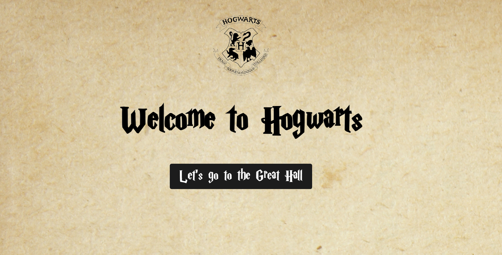

## HogwartsNFT

Welcome to HogwartsNFT, a magical NFT project inspired by the wizarding world of Harry Potter!

# What is HogwartsNFT?

HogwartsNFT is a decentralized application (dApp) that allows users to mint, collect, and trade unique digital assets, known as NFTs, inspired by the magical world of Hogwarts. Each NFT represents a unique item, such as a wand, a broomstick, or a magical creature, and is stored on the Ethereum blockchain.

# Features

Minting: Users can mint new NFTs, each with its own unique characteristics and attributes.
Collecting: Users can collect and store their NFTs in their digital wallets.
Trading: Users can trade their NFTs with other users on the platform.
Random House Assignment: Users can participate in a random house assignment, where they will be sorted into one of four houses: Gryffindor, Slytherin, Ravenclaw, or Hufflepuff.
Technical Details
Blockchain: HogwartsNFT is built on the Ethereum blockchain, using the ERC-721 standard for NFTs.
Smart Contracts: The project uses two smart contracts: HogwartsNFT for minting and managing NFTs, and RandomHouseAssignment for assigning users to a random house.
Frontend: The frontend is built using React and Web3.js, allowing users to interact with the smart contracts and manage their NFTs.

# Getting Started

To get started with HogwartsNFT, follow these steps:

Install MetaMask, a digital wallet that allows you to interact with the Ethereum blockchain.
Create a new account on the HogwartsNFT platform.
Mint your first NFT by clicking on the "Mint" button.
Explore the platform, collect and trade NFTs, and participate in the random house assignment.

License
HogwartsNFT is licensed under the MIT License.
